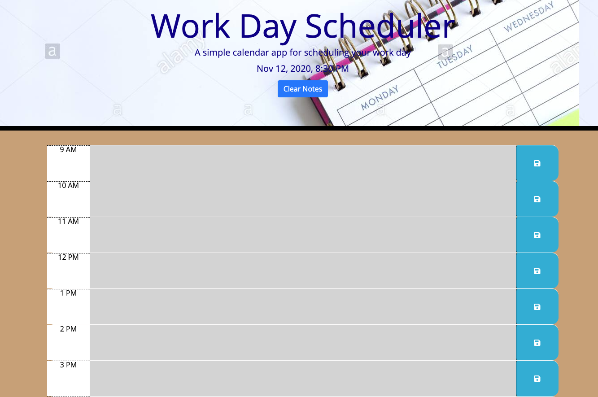
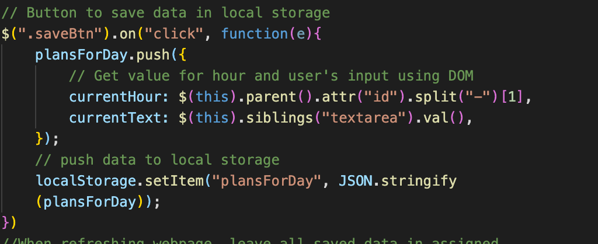

This application is a simple calander that allows the user to save events for each bussiness hour of the day(from 9AM to 5PM).
Depending on the time of day, the schedule input feilds update their color indicating to the user whether items are in the past, present or future(past hours are grey, future hours are green, and the current hour is red).

Here is the tne Work Day Scheduler view

When the user inputs a new event into an hour time block on the planner, he(she) can save the event into local storage by clicking the blue save button on the right side of the event.

When you refresh the page, saved events will be added to the planner from local storage.

If you no longer need your notes, you can erase them by pushing "Clear" button( at the top of the screen).Also you can see there Month/Date/Year and local time.

Here is an example of code that allows to save data to local storage.

Here is a link to deployed project https://slugovoy.github.io/Work-Day-Scheduler/